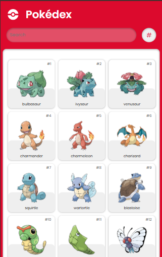
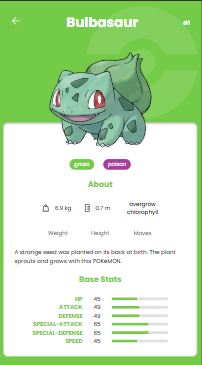

<h1 align="center">
     Pokédex
</h1>


<div align="center">
    
    

</div>


## 📝 About

This project is a **Pokédex** developed in *React*, where you can view information about various Pokémon, including their abilities, types and combat statistics.

The application uses the [PokéAPI](https://pokeapi.co) to retrieve Pokémon data and display it in a fun and organized way.

## 🚀 Technologies Used
- [Javascript](https://developer.mozilla.org/pt-BR/docs/Web/JavaScript)
- [React](https://react.dev/)
- [TypeScript](https://www.typescriptlang.org/)
- [Vite](https://vitejs.dev/)
- [CSS](https://developer.mozilla.org/pt-BR/docs/Web/CSS)

## 📦 How to install and start

```bash
# Clone the repository
$ git clone https://github.com/polyanetuag/pokedex.git

# Entry in the file directory
$ cd pokedex

# Install the dependencies
$ yarn ou npm install

# Start the server
$ yarn dev ou npm run dev

```

## 📋 License

This project is licensed under the [MIT](https://opensource.org/license/mit). 

See the [LICENSE](https://docs.github.com/en/repositories/managing-your-repositorys-settings-and-features/customizing-your-repository/licensing-a-repository) file for more details.


---
Developed with 💜 by Polyane Tuag
